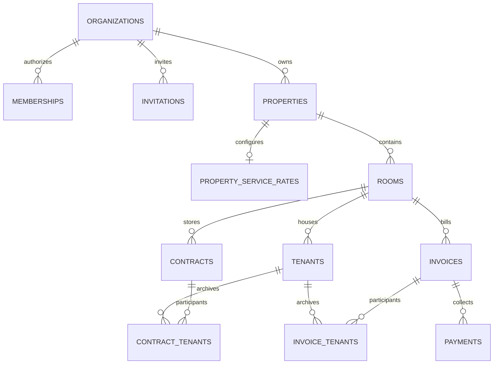

# Thiết kế dữ liệu HH HOME

Mọi dữ liệu nghiệp vụ thuộc một `organization_id`. Người tạo không gian là admin; email phải được xác nhận. Bắt đầu với các bảng nghiệp vụ trống.

| Bảng                   | Dữ liệu / ràng buộc                                                                                |
| ---------------------- | -------------------------------------------------------------------------------------------------- |
| organizations          | Tên không gian, UUID, ngày tạo                                                                     |
| memberships            | Khóa kép không gian + auth user, vai trò admin/manager/viewer, tên và email                        |
| invitations            | Email chuẩn hóa, vai trò manager/viewer; chỉ người có email đã xác nhận trùng khớp nhận được       |
| properties             | Tên duy nhất trong không gian, địa chỉ, chi phí thuê căn hộ/tháng                                  |
| rooms                  | Tên duy nhất trong căn hộ, giá cho thuê phòng/tháng                                                |
| tenants                | Hồ sơ, CCCD 12 số duy nhất trong không gian, phone 10 số, room_id, ngày vào/chuyển đi              |
| property_service_rates | Một bộ đơn giá hiện hành/căn hộ, khóa chính property_id, khóa ngoại kép bảo vệ organization_id     |
| contracts              | Tên tệp, đường dẫn riêng tư organization/room/random-id, ngày hiệu lực                             |
| invoices               | Một hóa đơn/phòng/kỳ, chỉ số cũ/mới, snapshot giá thuê và đơn giá, tổng tính bằng generated column |
| payments               | Thanh toán nhiều đợt, số tiền, thời điểm máy chủ, người ghi nhận                                   |

Tiền lưu dạng bigint VNĐ nguyên; mỗi giá/phí và tổng hóa đơn giới hạn 1.000.000.000.000 VNĐ. Chỉ số điện nước lưu integer không âm; chỉ số mới không nhỏ hơn cũ. Những phép tính vượt giới hạn bị từ chối thay vì lưu sai.

Khóa ngoại kép `(id, organization_id)` chặn việc gắn người thuê, hợp đồng hoặc hóa đơn của không gian A với phòng thuộc B. Không cho authenticated ghi trực tiếp hóa đơn/thanh toán/memberships. Functions dùng `security definer`, search_path rỗng, kiểm tra `auth.uid()`/vai trò, chỉ cấp EXECUTE cho authenticated. Không lấy role từ user_metadata.

## RPC

- `create_workspace`: tạo không gian và membership admin trong giao dịch; không tạo đơn giá khi chưa có căn hộ; không tạo dữ liệu minh họa.
- `accept_invitations`: khớp email trong auth.users đã xác nhận, thêm membership, tiêu thụ lời mời. Không tự nâng quyền của membership đã tồn tại.
- `set_member_role`: chỉ admin, khóa không gian để tránh hai thao tác đồng thời bỏ quản trị viên cuối.
- `create_property`: thêm căn hộ và các phòng trong một giao dịch.
- `create_invoice`: khóa phòng, kiểm tra kỳ tăng dần/chỉ số kỳ trước, lấy giá từ database, tính và lưu snapshot. Không hỗ trợ sửa hóa đơn đã lập.
- `record_payment`: khóa hóa đơn, tính số còn nợ từ payments, kiểm tra số tiền trước khi ghi nhận; tránh thu quá số nợ khi thao tác đồng thời.

## Hợp đồng

Bucket `contracts` private, tối đa 10 MB, MIME PDF/JPEG/PNG. Policy Storage xác nhận cả UUID không gian và UUID phòng tồn tại đúng quan hệ trước khi cho đọc/ghi. Viewer chỉ đọc, admin/manager tải lên. URL xem ký trong 60 giây. Tên file không được dùng làm đường dẫn; đường dẫn dùng UUID ngẫu nhiên. Metadata và object upload là hai thao tác, có bù trừ khi ghi metadata thất bại, không phải giao dịch phân tán.

## Báo cáo

Doanh thu = tổng payments theo tháng `paid_at` quy đổi Asia/Ho_Chi_Minh. Một hóa đơn tháng 9 thu vào tháng 10 thuộc doanh thu tháng 10. Công nợ kỳ = tổng invoice.total của kỳ trừ payments của các hóa đơn đó. Tỷ lệ lấp đầy hiện tại = số phòng có ít nhất một người đã vào ở và chưa chuyển đi tính đến ngày hiện tại ở Việt Nam, chia tổng số phòng. Chưa có báo cáo lịch sử lấp đầy theo từng tháng.

Mỗi lần tải dữ liệu truy vấn theo organization_id và phân trang 500 bản ghi, tránh bỏ mất dữ liệu do giới hạn trả về mặc định của API. Với hệ thống lớn hơn, nên bổ sung báo cáo tổng hợp tại PostgreSQL và phân trang UI thay vì tải toàn bộ hồ sơ.

Migration thứ hai chuyển các đơn giá cũ sang từng căn hộ hiện có; giữ nguyên snapshot hóa đơn và thanh toán. Bảng `legacy_organization_service_rates` lưu bản gốc sau nâng cấp và bị thu hồi quyền truy cập frontend. Căn hộ mới cần cấu hình đơn giá riêng trước khi lập hóa đơn.

## Xóa căn hộ

RPC `delete_property(org, target_property, confirmation_name)` kiểm tra quyền admin/manager, tên xác nhận và khóa căn hộ/phòng/người thuê. Migration 005 cho xóa khi mọi đợt thuê đã kết thúc theo ngày Việt Nam; chặn người đang ở và lịch thuê chưa kết thúc. Nếu chưa có dữ liệu, xóa phòng/đơn giá/căn hộ trong giao dịch. Nếu có lịch sử hoặc tệp Storage, cập nhật `properties.deleted_at`; giữ toàn bộ khóa ngoại, hồ sơ, chứng từ, tệp và thanh toán. UI lọc căn hộ/phòng đã xóa khỏi quản lý hiện tại, vẫn dùng tham chiếu lịch sử cho hồ sơ và báo cáo.

Chỉ RPC được thay đổi `deleted_at`; quyền INSERT/UPDATE của frontend giới hạn các cột nghiệp vụ. Trigger chặn ghi phòng, đơn giá, hợp đồng, hóa đơn, đợt thuê vào căn hộ đã xóa, nhưng cho sửa thông tin liên hệ của hồ sơ cũ. Thu tiền và đọc Storage vẫn hoạt động; không cho tải lên/xóa tệp hợp đồng đã lưu trữ. Khóa SHARE trên căn hộ ở trigger/Storage và khóa UPDATE khi xóa ngăn thao tác phát sinh đồng thời. Unique index tên chỉ áp dụng căn hộ hiện hành, cho tái sử dụng tên mà không trộn lịch sử.

## Lưu trữ khi chuyển đi

Migration 004 thêm `invoice_tenants` và `contract_tenants`, khóa ngoại kép xác nhận cùng không gian. Trigger chốt người liên quan khi tạo chứng từ; migration liên kết dữ liệu cũ bằng thời gian thuê/thời điểm lập. Liên kết không tự thay đổi khi chuyển đi hoặc thêm người mới. Admin/manager có thể thêm liên kết qua `link_tenant_document`; RLS cho các vai trò cùng không gian đọc, không cho ghi/xóa liên kết trực tiếp.

Ghi nhận chuyển đi cập nhật `tenants.move_out`; `room_id` vẫn giữ làm tham chiếu lịch sử, nhưng người thuê không hiện trong danh sách đang ở. Chứng từ trong phòng được lọc theo người liên quan đang ở; chứng từ chung vẫn còn cho người ở lại. Hồ sơ người thuê hiện chứng từ liên quan và thanh toán gốc; không sao chép hóa đơn hoặc nhân đôi doanh thu. Tài liệu cũ chưa có liên kết vẫn hiện để quản lý gán đúng người. Ngày vào ở/phòng của hồ sơ đã có chứng từ được bảo vệ; không mở lại đợt ở đã kết thúc.
